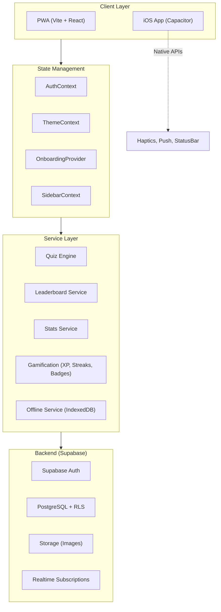

# Idoneo

> 🎯 **La piattaforma italiana per la preparazione ai concorsi pubblici**

Idoneo è un'applicazione web/mobile per la preparazione ai concorsi pubblici italiani (Polizia, Carabinieri, Forze Armate, ecc.). La piattaforma offre simulazioni d'esame realistiche, tracking dei progressi, classifiche competitive e un sistema di gamification per mantenere alta la motivazione degli utenti.

L'app è costruita come Progressive Web App (PWA) e come app nativa iOS tramite Capacitor, permettendo un'esperienza fluida su qualsiasi dispositivo.

---

## 📋 Table of Contents

- [Architecture Overview](#architecture-overview)
- [Tech Stack](#tech-stack)
- [Getting Started](#getting-started)
- [Project Structure](#project-structure)
- [Available Scripts](#available-scripts)
- [Deployment](#deployment)
- [Troubleshooting](#troubleshooting)

---

## Architecture Overview



### Key Data Flows

1. **Quiz Flow**: User selects contest → chooses quiz type → runs timed simulation → results saved to `quiz_attempts` → leaderboard updated via database trigger
2. **Gamification Flow**: Quiz completion → XP awarded → streak updated → badges checked and awarded
3. **Offline Flow**: Questions cached in IndexedDB → offline attempts saved locally → synced when online

---

## Tech Stack

| Layer | Technology |
|-------|------------|
| **Frontend Framework** | React 19 + TypeScript |
| **Build Tool** | Vite 6 |
| **Styling** | TailwindCSS 3.4 + CSS Variables |
| **Animations** | Framer Motion |
| **Routing** | React Router DOM 7 |
| **Backend** | Supabase (Auth, PostgreSQL, Storage) |
| **Mobile** | Capacitor 8 (iOS) |
| **PWA** | vite-plugin-pwa |
| **Analytics** | Google Analytics 4 (react-ga4) |
| **Testing** | Vitest + Testing Library |

---

## Getting Started

### Prerequisites

- **Node.js** 18+ 
- **npm** (comes with Node.js)
- **Xcode** (only for iOS development)

### Installation

1. **Clone the repository**
   ```bash
   git clone https://github.com/yesmantech/idoneo.git
   cd idoneo
   ```

2. **Install dependencies**
   ```bash
   npm install
   ```

3. **Set up environment variables**
   
   Create a `.env.local` file in the root directory:
   ```env
   VITE_SUPABASE_URL=https://your-project.supabase.co
   VITE_SUPABASE_ANON_KEY=your-anon-key-here
   ```
   
   > See [docs/ENVIRONMENT.md](docs/ENVIRONMENT.md) for detailed variable documentation.

4. **Start the development server**
   ```bash
   npm run dev
   ```
   
   Open [http://localhost:3000](http://localhost:3000) in your browser.

### iOS Development

```bash
# Build and sync to iOS
npm run build:ios

# Open in Xcode
npm run cap:open:ios
```

---

## Project Structure

```
idoneo/
├── src/                          # Main source code
│   ├── App.tsx                   # Root component with all routes
│   ├── index.css                 # Global styles + CSS variables
│   │
│   ├── app/                      # Page components (file-based routing pattern)
│   │   ├── page.tsx              # / - Home page
│   │   ├── admin/                # /admin/* - Admin dashboard (protected)
│   │   ├── blog/                 # /blog/* - User-facing blog
│   │   ├── concorsi/             # /concorsi/* - Contest browsing
│   │   ├── leaderboard/          # /leaderboard - Rankings
│   │   ├── login/                # /login - Authentication
│   │   ├── profile/              # /profile/* - User profile
│   │   ├── quiz/                 # /quiz/* - Quiz engine
│   │   └── stats/                # /stats - Statistics dashboard
│   │
│   ├── components/               # Reusable UI components
│   │   ├── admin/                # Admin-specific components
│   │   ├── auth/                 # Auth guards (WaitlistGuard, AdminGuard)
│   │   ├── common/               # Shared utilities (ErrorBoundary)
│   │   ├── gamification/         # Streaks, badges, celebrations
│   │   ├── home/                 # Homepage sections
│   │   ├── layout/               # Layout wrappers
│   │   ├── leaderboard/          # Leaderboard UI
│   │   ├── quiz/                 # Quiz runner components
│   │   └── ui/                   # Base UI primitives
│   │
│   ├── context/                  # React Context providers
│   │   ├── AuthContext.tsx       # User auth state + profile
│   │   ├── OnboardingProvider.tsx# Onboarding tour state
│   │   ├── SidebarContext.tsx    # Mobile sidebar visibility
│   │   ├── SpotlightContext.tsx  # Feature spotlight modal
│   │   └── ThemeContext.tsx      # Dark/light theme
│   │
│   ├── hooks/                    # Custom React hooks
│   │   ├── useConcorsoData.ts    # Fetch contest hierarchy
│   │   ├── useRoleHubData.ts     # Fetch role page data
│   │   └── ...                   # Other domain-specific hooks
│   │
│   ├── lib/                      # Business logic & services
│   │   ├── supabaseClient.ts     # Supabase client singleton
│   │   ├── leaderboardService.ts # Leaderboard CRUD + algorithms
│   │   ├── statsService.ts       # Analytics & recommendations
│   │   ├── offlineService.ts     # IndexedDB offline support
│   │   ├── streakService.ts      # Daily streak tracking
│   │   ├── badgeService.ts       # Achievement badges
│   │   ├── xpService.ts          # XP/points system
│   │   └── ...                   # Other services
│   │
│   └── types/                    # TypeScript definitions
│       ├── database.ts           # Supabase schema types
│       └── blog.ts               # Blog-specific types
│
├── scripts/                      # Development & debug scripts
├── supabase/                     # Database migrations
│   └── migrations/               # SQL migration files
├── ios/                          # iOS native app (Capacitor)
├── public/                       # Static assets
│
├── vite.config.ts                # Vite configuration
├── capacitor.config.ts           # Capacitor iOS config
├── tailwind.config.js            # Tailwind CSS config
└── package.json                  # Dependencies & scripts
```

---

## Available Scripts

| Command | Description |
|---------|-------------|
| `npm run dev` | Start development server on port 3000 |
| `npm run dev:host` | Start dev server accessible from network |
| `npm run build` | Build for production |
| `npm run preview` | Preview production build locally |
| `npm run test` | Run tests with Vitest |
| `npm run test:ui` | Run tests with Vitest UI |
| `npm run build:ios` | Build + sync to iOS |
| `npm run cap:open:ios` | Open iOS project in Xcode |

---

## Deployment

### Vercel (Production)

The app is deployed on Vercel. Push to `main` triggers automatic deployment.

```bash
# Manual build
npm run build
```

The `vercel.json` configuration handles SPA routing:
```json
{
  "rewrites": [{ "source": "/(.*)", "destination": "/index.html" }]
}
```

### iOS App Store

1. Build the web app: `npm run build`
2. Sync to iOS: `npx cap sync ios`
3. Open Xcode: `npx cap open ios`
4. Archive and submit through Xcode

---

## Troubleshooting

### Common Issues

#### Development server shows blank page
```bash
# Clear Vite cache
rm -rf node_modules/.vite
npm run dev
```

#### iOS build fails with signing errors
- Open Xcode and configure signing in the project settings
- Ensure you have a valid Apple Developer account

#### Supabase connection errors
- Verify `.env.local` contains correct `VITE_SUPABASE_URL` and `VITE_SUPABASE_ANON_KEY`
- Check if the Supabase project is active (not paused)

#### Offline mode not working
- Clear browser cache and reload
- Check IndexedDB in DevTools → Application → IndexedDB

### Getting Help

- Check [docs/ARCHITECTURE.md](docs/ARCHITECTURE.md) for system design
- Check [docs/CONTRIBUTING.md](docs/CONTRIBUTING.md) for development guidelines
- Check [docs/ENVIRONMENT.md](docs/ENVIRONMENT.md) for environment variables

---

## License

Private - All Rights Reserved

---

*Built with ❤️ for Italian civil service exam candidates*
