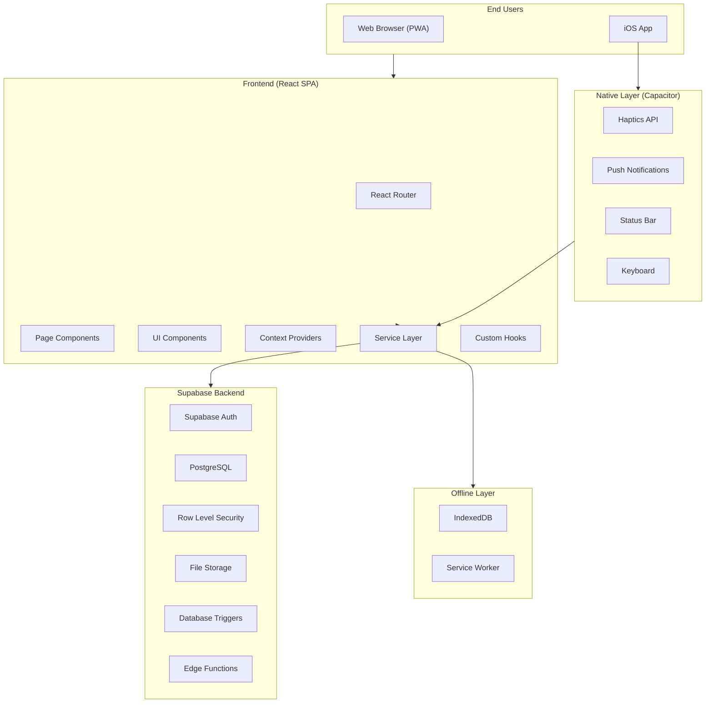
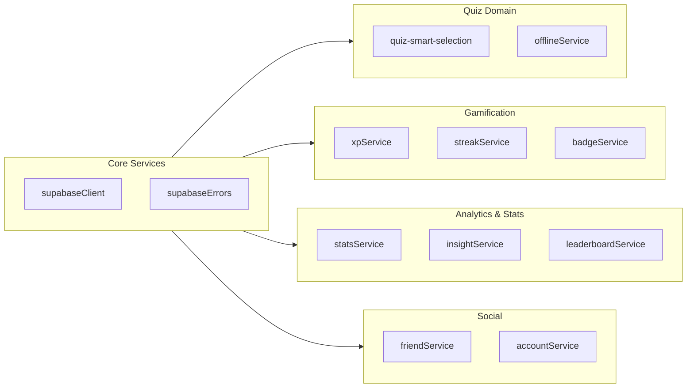
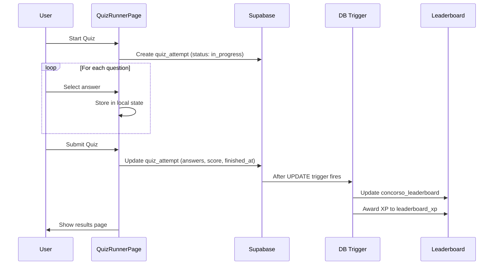
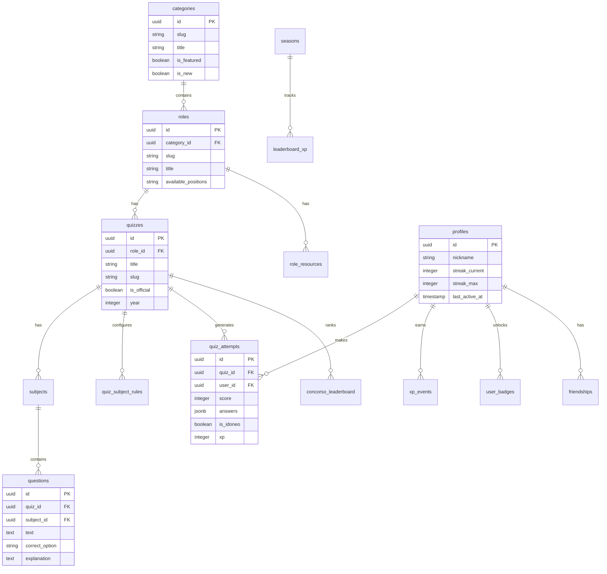
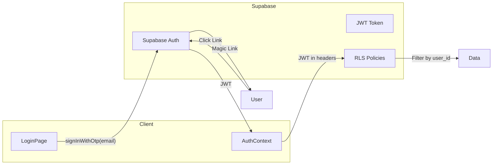

# Architecture

> System design documentation for the Idoneo platform

This document provides an in-depth look at the architecture, major components, data flow, and key design decisions of the Idoneo application.

---

## Table of Contents

- [System Overview](#system-overview)
- [Major Components](#major-components)
- [Data Flow](#data-flow)
- [Database Schema](#database-schema)
- [Authentication Model](#authentication-model)
- [Error Handling Strategy](#error-handling-strategy)
- [Observability & Logging](#observability--logging)
- [Key Design Decisions](#key-design-decisions)

---

## System Overview



### Architecture Principles

1. **Offline-First**: Core quiz functionality works without network connectivity
2. **Mobile-First**: UI designed for touch devices, responsive to desktop
3. **Progressive Enhancement**: PWA features enhance the experience on capable devices
4. **Server-Side Security**: All data access controlled by PostgreSQL RLS policies

---

## Major Components

### Frontend Layer

| Component | Location | Responsibility |
|-----------|----------|----------------|
| **App.tsx** | `src/App.tsx` | Route definitions, provider hierarchy |
| **Context Providers** | `src/context/` | Global state (auth, theme, sidebar, onboarding) |
| **Page Components** | `src/app/` | Route-specific UI and data fetching |
| **Shared Components** | `src/components/` | Reusable UI building blocks |
| **Services** | `src/lib/` | Business logic, API calls, algorithms |
| **Hooks** | `src/hooks/` | Reusable stateful logic |

### Service Layer (`src/lib/`)



### Context Provider Hierarchy

```tsx
<ThemeProvider>           // Dark/light mode
  <AuthProvider>          // User session & profile
    <SidebarProvider>     // Mobile sidebar state
      <OnboardingProvider>// First-time user tour
        <SpotlightProvider>// Feature highlights
          <App />
        </SpotlightProvider>
      </OnboardingProvider>
    </SidebarProvider>
  </AuthProvider>
</ThemeProvider>
```

---

## Data Flow

### Quiz Attempt Flow



### Leaderboard Score Calculation

The `concorso_leaderboard` table stores a composite score calculated from 5 factors:

| Factor | Weight | Description |
|--------|--------|-------------|
| **Volume** | 20% | Total correct answers |
| **Accuracy** | 25% | Correct / Total ratio |
| **Recency** | 20% | More weight to recent attempts |
| **Coverage** | 20% | Subject diversity |
| **Reliability** | 15% | Consistency over time |

```sql
-- Calculated by database trigger on quiz_attempts insert/update
composite_score = (
    volume_score * 0.20 +
    accuracy_score * 0.25 +
    recency_score * 0.20 +
    coverage_score * 0.20 +
    reliability_score * 0.15
)
```

---

## Database Schema

### Entity Relationship Diagram



### Key Tables

| Table | Purpose |
|-------|---------|
| `categories` | Top-level contest categories (Polizia, Carabinieri, etc.) |
| `roles` | Specific roles within categories (Allievo Agente, Maresciallo, etc.) |
| `quizzes` | Individual quiz/exam definitions |
| `subjects` | Subject areas within a quiz (Italiano, Storia, etc.) |
| `questions` | Multiple choice questions with explanations |
| `quiz_attempts` | User's quiz session with answers and score |
| `profiles` | Extended user profile with gamification data |
| `concorso_leaderboard` | Per-quiz skill rankings |
| `leaderboard_xp` | Global XP rankings by season |
| `seasons` | Weekly XP season definitions |

---

## Authentication Model

### Supabase Auth + RLS



### Access Control

| Role | Description | Access |
|------|-------------|--------|
| **Anonymous** | Not logged in | Read public data (categories, quizzes, questions) |
| **Authenticated** | Logged in user | Own attempts, profile, leaderboard participation |
| **Admin** | `profiles.role = 'admin'` | Full CRUD on all tables |

### RLS Policy Example

```sql
-- Users can only see their own attempts
CREATE POLICY "Users can view own attempts"
ON quiz_attempts FOR SELECT
USING (auth.uid() = user_id);

-- Users can insert their own attempts
CREATE POLICY "Users can create own attempts"
ON quiz_attempts FOR INSERT
WITH CHECK (auth.uid() = user_id);
```

---

## Error Handling Strategy

### Client-Side Error Boundaries

```tsx
// Wrap app in ErrorBoundary to catch React errors
<ErrorBoundary>
  <App />
</ErrorBoundary>
```

### Supabase Error Handling

```typescript
// src/lib/supabaseErrors.ts
export function handleSupabaseError(error: PostgrestError): string {
  // Map database errors to user-friendly messages
  switch (error.code) {
    case '23505': return 'This record already exists';
    case '23503': return 'Referenced record not found';
    case 'PGRST116': return 'No data found';
    default: return 'An unexpected error occurred';
  }
}
```

### Error Categories

| Category | Handling |
|----------|----------|
| **Network Errors** | Retry with exponential backoff, show offline indicator |
| **Auth Errors** | Redirect to login, clear session |
| **Database Errors** | Log to console, show user-friendly message |
| **Validation Errors** | Show inline field errors |

---

## Observability & Logging

### Analytics (Google Analytics 4)

```typescript
// src/lib/analytics.ts
analytics.trackEvent('quiz_completed', {
  quiz_id: quizId,
  score: score,
  duration_seconds: duration,
  is_idoneo: isPassing
});
```

### Tracked Events

| Event | Description |
|-------|-------------|
| `page_view` | Page navigation |
| `quiz_started` | User begins a quiz |
| `quiz_completed` | User finishes a quiz |
| `question_answered` | Individual question response |
| `badge_earned` | User unlocks achievement |
| `streak_updated` | Daily streak changed |

### Console Logging

- **Development**: Verbose logging enabled
- **Production**: Errors only, no sensitive data

---

## Key Design Decisions

### 1. Vite over Next.js

**Decision**: Migrated from Next.js to Vite + React SPA

**Rationale**:
- Simpler deployment (static files)
- Better Capacitor integration for iOS
- Faster development builds
- No need for SSR (content is user-specific)

**Tradeoffs**:
- Lose built-in SSR/SSG
- Manual route code-splitting

---

### 2. Supabase as Backend

**Decision**: Use Supabase instead of custom backend

**Rationale**:
- Built-in auth with magic links
- PostgreSQL with RLS for security
- Real-time subscriptions
- Generous free tier

**Tradeoffs**:
- Vendor lock-in
- Limited compute for complex logic (use triggers)

---

### 3. Offline-First with IndexedDB

**Decision**: Cache questions in IndexedDB, sync attempts later

**Rationale**:
- Users may have poor connectivity
- Exams should work offline
- Data persists across sessions

**Tradeoffs**:
- Complex sync logic
- Potential data conflicts

---

### 4. Database Triggers for Score Calculation

**Decision**: Calculate leaderboard scores via PostgreSQL triggers

**Rationale**:
- Atomic updates (no race conditions)
- Single source of truth
- Offload compute from client

**Tradeoffs**:
- Harder to debug
- Requires migration for changes

---

### 5. CSS Variables + Tailwind

**Decision**: Use CSS custom properties for theming, Tailwind for utilities

**Rationale**:
- Dynamic theme switching
- Consistent design tokens
- Rapid UI development

**Tradeoffs**:
- Larger CSS bundle
- Learning curve for custom properties

---

## Further Reading

- [CONTRIBUTING.md](./CONTRIBUTING.md) - Development guidelines
- [ENVIRONMENT.md](./ENVIRONMENT.md) - Environment variables
